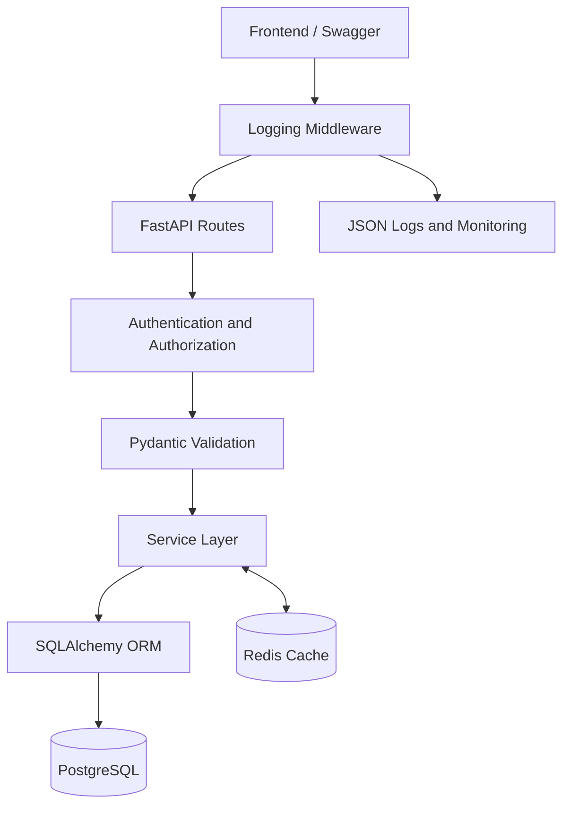

# LibraDesk — Library Management System

LibraDesk is a modular Library Management System developed for the **DSC 306 — R and Python Programming Language** course during **Summer 2026**.

The project combines a production-style FastAPI backend, PostgreSQL persistence, JWT-based security, Redis caching, structured monitoring, automated testing, and a responsive frontend for demonstration and user interaction.

## Highlights

- JWT registration and login using OAuth2 Password Flow
- Admin and Member Role-Based Access Control
- Full book CRUD with validation and correct HTTP responses
- Case-insensitive book search by title, author, or ISBN
- Available-books filtering with pagination
- Borrowing, returning, availability tracking, and borrowing history
- Maximum active-borrow limit and duplicate-borrow protection
- Transaction-safe borrow and return operations
- Redis Cache-Aside with HIT, MISS, BYPASS, TTL, and invalidation
- Structured JSON logging with unique request IDs
- Live monitoring dashboard for requests, errors, latency, and cache metrics
- Responsive frontend with search, filters, modals, toasts, and role-aware actions
- PostgreSQL for application runtime
- Isolated SQLite database and fake Redis implementation during testing
- Pytest and FastAPI TestClient automated test suite
- Idempotent seed command for realistic presentation data
- GitHub feature branches, Pull Requests, and automated CI checks

## Technology Stack

| Technology | Responsibility |
|---|---|
| Python 3.11 | Application runtime |
| FastAPI | REST API framework |
| Uvicorn | ASGI application server |
| PostgreSQL | Production-style relational database |
| SQLAlchemy 2.0 | ORM and database operations |
| Pydantic v2 | Request and response validation |
| PyJWT | JWT creation and validation |
| pwdlib | Secure password hashing and verification |
| Redis | Cache-Aside implementation |
| Pytest | Automated testing framework |
| FastAPI TestClient | API integration testing |
| HTML, CSS, and JavaScript | Optional demonstration frontend |
| Git and GitHub | Version control and team collaboration |

## Project Structure

```text
library-management-system/
├── backend/
│   ├── app/
│   │   ├── api/v1/routes/   # FastAPI endpoints
│   │   ├── auth/            # JWT and role dependencies
│   │   ├── cache/           # Redis Cache-Aside
│   │   ├── core/            # Settings, security, and logging
│   │   ├── db/              # SQLAlchemy engine and sessions
│   │   ├── frontend/        # Route that serves the frontend
│   │   ├── middleware/      # Request logging and metrics
│   │   ├── models/          # SQLAlchemy entities
│   │   ├── monitoring/      # Metrics and monitoring dashboard
│   │   ├── schemas/         # Pydantic request/response models
│   │   ├── scripts/         # Admin and demo-data commands
│   │   └── services/        # Business rules
│   ├── tests/               # Automated API tests
│   ├── requirements.txt
│   └── Dockerfile
├── frontend/
│   ├── index.html
│   └── assets/
│       ├── css/styles.css
│       └── js/              # API, auth, catalog, circulation, and UI modules
├── docs/
│   └── DISCUSSION_GUIDE.md
├── .github/
│   └── workflows/           # GitHub Actions CI
├── docker-compose.yml
├── .env.example
└── README.md
```

## System Architecture



FastAPI routes handle HTTP concerns and delegate business logic to service functions. SQLAlchemy manages PostgreSQL operations, while Redis accelerates supported book-read operations without becoming the source of truth.

If Redis is unavailable, the application safely bypasses the cache and continues reading from PostgreSQL.

## Local Setup on Windows

The primary course setup runs locally on Windows without requiring Docker.

From the project root:

```cmd
py -3.11 -m venv .venv
.venv\Scripts\activate
python --version
python -m pip install --upgrade pip
python -m pip install -r backend\requirements.txt
python -m pip check
copy .env.example .env
```

Configure the PostgreSQL `DATABASE_URL` and other development values inside `.env`.

Do not commit `.env` or expose database credentials, JWT secrets, passwords, or access tokens.

Confirm that PostgreSQL is running. Redis should also run locally when demonstrating caching. If Redis is temporarily unavailable, the API continues using PostgreSQL and reports:

```text
X-Cache: BYPASS
```

### Create an Administrator

Enter the backend folder:

```cmd
cd backend
```

Create an Admin account if one does not already exist:

```cmd
python -m app.scripts.create_admin --name "Seif Ahmed" --email admin@library.com
```

### Add Demo Data

Add realistic presentation data without deleting existing PostgreSQL records:

```cmd
python -m app.scripts.seed_demo
```

The seed command is idempotent and adds 15 book titles, three members, and nine mixed borrowing records.

Demo members use the following development-only password:

```text
Member123!
```

### Start the Application

From the `backend` folder:

```cmd
python -m uvicorn app.main:app --reload
```

Open:

- Frontend: <http://127.0.0.1:8000/app>
- Swagger UI: <http://127.0.0.1:8000/docs>
- Health endpoint: <http://127.0.0.1:8000/health>
- Monitoring dashboard: <http://127.0.0.1:8000/monitoring>

Stop the server safely using `Ctrl+C`.

## Optional Docker Setup

Docker files are included as an additional deployment option, but Docker is not required for the primary Windows setup.

From the project root:

```cmd
docker compose up --build -d
docker compose exec app python -m app.scripts.seed_demo
```

Docker Compose starts FastAPI, PostgreSQL, and Redis together.

Stop the containers without deleting stored data:

```cmd
docker compose down
```

## Main API Endpoints

| Method | Endpoint | Access | Purpose |
|---|---|---|---|
| POST | `/api/v1/auth/register` | Public | Register a new Member |
| POST | `/api/v1/auth/login` | Public | Verify credentials and receive a JWT |
| GET | `/api/v1/auth/me` | Authenticated | Read the current authenticated user |
| GET | `/api/v1/books` | Authenticated | List books with pagination and caching |
| GET | `/api/v1/books/available` | Authenticated | List books with available copies |
| GET | `/api/v1/books/search` | Authenticated | Search by title, author, or ISBN |
| GET | `/api/v1/books/{book_id}` | Authenticated | Read one book with caching |
| POST | `/api/v1/books` | Admin | Create a book |
| PUT | `/api/v1/books/{book_id}` | Admin | Update a book |
| DELETE | `/api/v1/books/{book_id}` | Admin | Delete a book |
| POST | `/api/v1/borrows` | Member | Borrow a book |
| POST | `/api/v1/borrows/{borrow_id}/return` | Member | Return a borrowed book |
| GET | `/api/v1/borrows/me/history` | Member | View personal borrowing history |
| GET | `/api/v1/borrows` | Admin | View all borrowing records |
| GET | `/health` | Public | Check application, database, and Redis health |
| GET | `/monitoring/data` | Public | Read monitoring dashboard data |
| GET | `/monitoring` | Public | Open the monitoring dashboard |

### Search Example

Search requests use the `query` parameter and support pagination:

```http
GET /api/v1/books/search?query=python&skip=0&limit=20
```

The search is case-insensitive and checks:

- Book title
- Author name
- ISBN

### Available Books Example

```http
GET /api/v1/books/available?skip=0&limit=20
```

Only books where `available_copies > 0` are returned.

Both discovery endpoints require a valid authenticated user.

## Authentication and Roles

Protected endpoints expect:

```http
Authorization: Bearer <access-token>
```

A JWT is signed, not encrypted. The token payload contains the user identifier in `sub` and an expiration value in `exp`. Passwords, secrets, and sensitive credentials must never be stored inside the token.

| Capability | Admin | Member |
|---|---:|---:|
| Register and login | Yes | Yes |
| View own profile | Yes | Yes |
| Read and search books | Yes | Yes |
| View available books | Yes | Yes |
| Create, update, and delete books | Yes | No |
| Borrow and return books | No | Yes |
| View personal borrowing history | No | Yes |
| View all borrowing records | Yes | No |

## Redis Cache Demonstration

Request the same supported book resource twice through Swagger or another API client.

The expected sequence is:

1. First request reads from PostgreSQL and returns `X-Cache: MISS`.
2. The response is serialized and stored in Redis.
3. The second identical request returns `X-Cache: HIT`.
4. A create, update, delete, borrow, or return operation invalidates the relevant cache.
5. The next supported book read returns `MISS` again.

If Redis is unavailable, the response returns `X-Cache: BYPASS`, and PostgreSQL remains the source of truth.

## Testing

Tests run using an isolated SQLite database so they remain fast and independent from the local PostgreSQL presentation database. Redis behavior is tested using a fake in-memory implementation.

From the `backend` folder:

```cmd
python -m compileall -q app tests
python -m pytest -q
```

Latest verified local result:

```text
57 passed, 1 warning in 57.38s
```

The warning is a dependency deprecation warning from the FastAPI/Starlette TestClient environment and does not represent a failed test.

The automated suite covers:

- Registration and login
- JWT authentication
- Admin and Member roles
- Book CRUD
- Request validation
- Book searching
- Available-books filtering
- Pagination
- Borrow and return rules
- Duplicate-borrow protection
- Active-borrow limits
- Redis cache behavior and invalidation
- Health and monitoring
- Frontend page and static assets

## Git Workflow

- `main`: stable and submission-ready code
- `develop`: integrated development code
- `feature/*`: isolated feature development
- `docs/*`: isolated documentation changes

Feature work should be implemented on a dedicated branch, verified using automated tests, and submitted to `develop` through a Pull Request. A release Pull Request then promotes the integrated version from `develop` to `main`.

Recent verified contributions include:

| GitHub User | Branch | Contribution | Pull Request |
|---|---|---|---|
| `ahmedkhaled3152005-tech` | `feature/book-search` | Case-insensitive book search with tests | [#8](https://github.com/seif-ahmed-ib/library-management-system/pull/8) |
| `motazlapep` | `feature/available-books` | Available-books endpoint with pagination and tests | [#10](https://github.com/seif-ahmed-ib/library-management-system/pull/10) |

Never commit:

- `.env`
- Access tokens or passwords
- Database files
- Application log files
- `.venv`
- Local cache files

## Discussion and Demonstration Guide

See [DISCUSSION_GUIDE.md](docs/DISCUSSION_GUIDE.md) for the presentation walkthrough, demonstration order, and likely individual discussion questions.